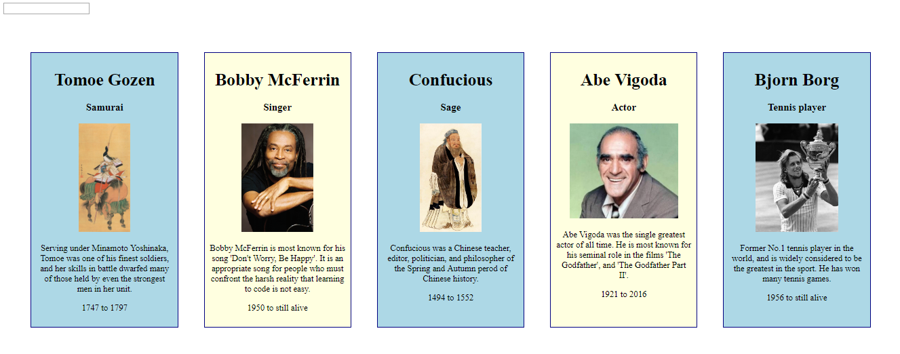

# What You See Is What You Get

## Description
This is a card-editor app that makes use of event listeners, tests our understanding of order of importance in JavaScript, and challenges our ability to 'traverse the dom'. Once loaded, the user can click a card, and use the input field to edit the description of that card. And nothing else.

## Screenshots



## How to run this project
* Clone this repository to your local machine.
* Use npm to install http-server in your terminal:
```sh
npm install -g http-server
```
* Run the server in your terminal
```sh
hs -p 9999
```
* Open chrome and navigate to:
```
localhost: 9999
```
